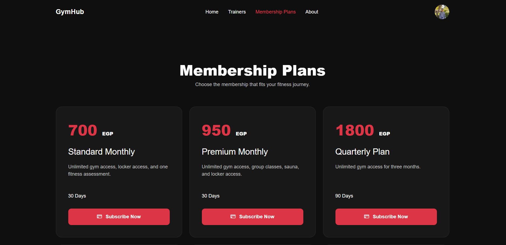
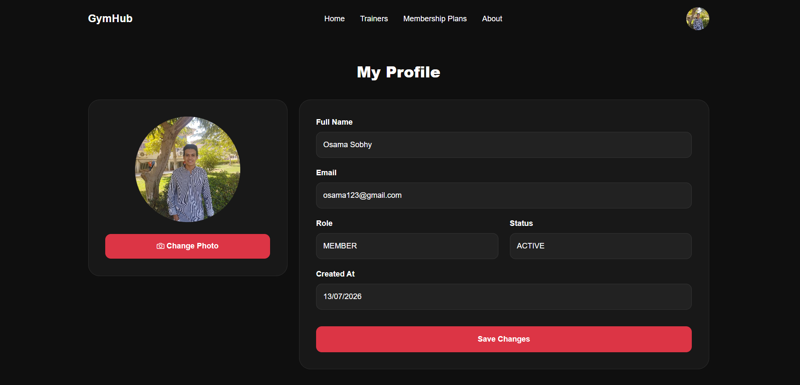
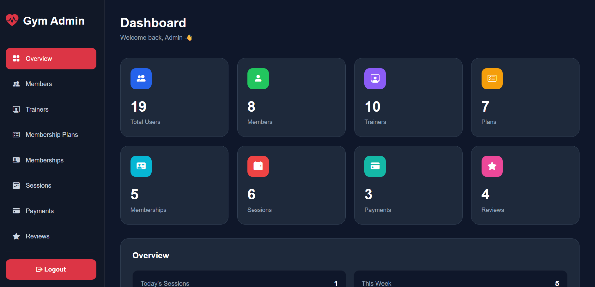
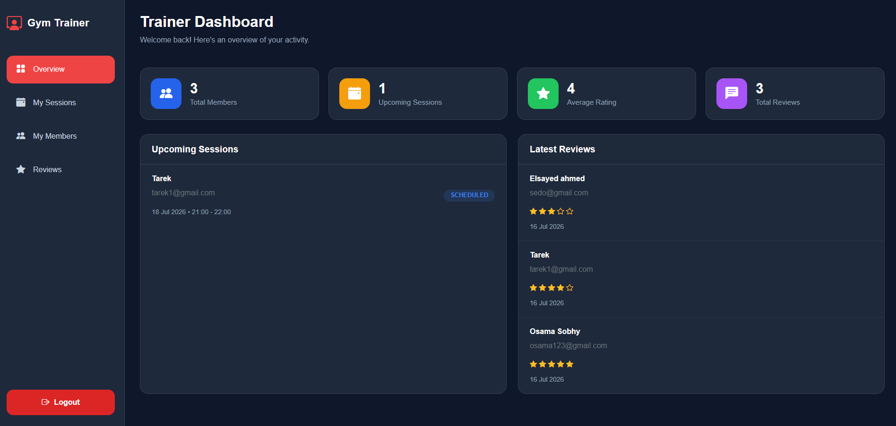

# 🏋️ Gym Management System

A full-stack Gym Management System built with **Angular 21**, **NestJS 11**, **PostgreSQL**, and **TypeORM**. The application simulates a real-world gym management platform with secure authentication, membership management, trainer scheduling, online payments, and role-based dashboards for Members, Trainers, and Administrators.

---

## 🚀 Features

### 🔐 Authentication & Security

- JWT Authentication
- Role-Based Authorization
- Protected Routes & Guards
- Password Hashing with bcrypt
- Request Validation
- Helmet Security
- Rate Limiting
- File Upload Validation

---

## 👤 Member Features

- Register & Login
- Edit Personal Profile
- Upload Profile Picture
- Browse Membership Plans
- Purchase Memberships
- Stripe Checkout Integration
- Membership History
- Browse Trainers
- View Trainer Profiles
- Book Training Sessions
- View My Sessions
- Leave Trainer Reviews
- View Payment Status

---

## 🏋️ Trainer Features

- Trainer Dashboard
- Dashboard Statistics
- Upcoming Sessions
- Assigned Members
- View Reviews
- Session Details
- Member Details
- Profile Management

---

## 👑 Admin Features

Complete Management Dashboard including:

- Dashboard Overview
- Members Management
- Trainers Management
- Membership Plans
- Membership Management
- Sessions Management
- Payments Management
- Reviews Management

Each module supports:

- Create
- Update
- Delete
- Search
- View Details

---

## 💳 Payment System

Integrated with **Stripe Checkout**

Features include:

- Secure Checkout
- Success & Cancel Pages
- Payment History
- Membership Activation
- Stripe Webhooks

---

## ⭐ Review System

Members can:

- Rate Trainers
- Write Reviews
- View Submitted Reviews

Admins and Trainers can:

- View Reviews
- Review Details
- Rating Statistics

---

# 🛠 Tech Stack

## Frontend

- Angular 21
- TypeScript
- Bootstrap 5
- Bootstrap Icons
- Angular Signals
- Reactive Forms
- RxJS
- ngx-toastr

---

## Backend

- NestJS 11
- TypeScript
- TypeORM
- PostgreSQL
- JWT
- Swagger
- Multer
- bcrypt
- class-validator
- class-transformer
- Helmet
- Stripe

---

## Database

- PostgreSQL

---

# 📂 Project Structure

```
Gym-Management-System
│
├── backend
│   ├── auth
│   ├── common
│   │   ├── decorators
│   │   ├── enums
│   │   ├── guards
│   │   ├── interfaces
│   │   └── multer
│   ├── dashboard
│   ├── membership
│   ├── membership-plans
│   ├── payment
│   ├── reviews
│   ├── security
│   ├── sessions
│   ├── users
│   └── main.ts
│
├── frontend
│   ├── components
│   ├── guards
│   ├── layouts
│   ├── models
│   ├── pages
│   │   ├── admin-dashboard
│   │   ├── trainer-dashboard
│   │   ├── plans
│   │   ├── profile
│   │   ├── trainers
│   │   ├── trainer-profile
│   │   ├── session
│   │   ├── my-membership
│   │   ├── rating
│   │   ├── login
│   │   ├── register
│   │   └── home
│   ├── services
│   └── validators
│
└── README.md
```

---

# 📊 Dashboards

## Admin Dashboard

- Dashboard Overview
- Members
- Trainers
- Membership Plans
- Memberships
- Sessions
- Payments
- Reviews

---

## Trainer Dashboard

- Overview
- My Sessions
- My Members
- My Reviews

---

# 📚 API Documentation

Swagger documentation is available after running the backend.

```
/api/docs
```

---

# ⚙️ Installation

## Clone Repository

```bash
git clone https://github.com/OsamaSobhy2006/GymHub.git

cd GymHub
```

---

## Backend

```bash
cd backend

npm install

npm run start:dev
```

---

## Frontend

```bash
cd frontend

npm install

ng serve
```

---

# 🌍 Environment Variables

Create a `.env` file inside the backend directory.

```env
PORT=8000

# for development
DB_USERNAME=
DB_PASSWORD=
DB_PORT=
DB_DATABASE=
DB_HOST=
DB_NAME=

# for production
DATABASE_URL=

JWT_SECRET=

STRIPE_SECRET_KEY=
STRIPE_WEBHOOK_SECRET=
```

---

# 📸 Screenshots

### 🏠 Home Page


### 💳 Membership Plans


### 👤 User Profile


### 👑 Admin Dashboard


### 🏋️ Trainer Dashboard



---


# 👨‍💻 Author

**Osama Sobhy**